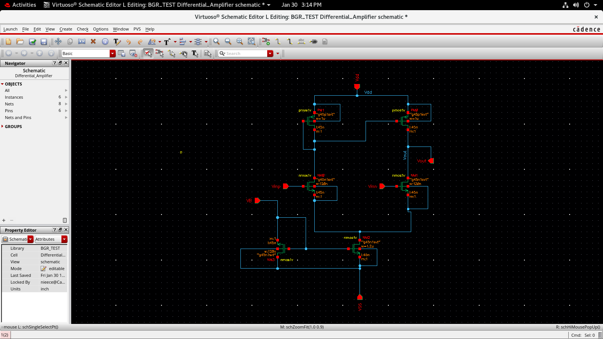
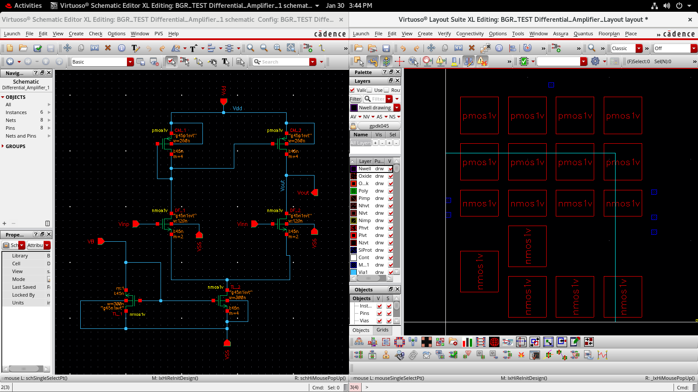
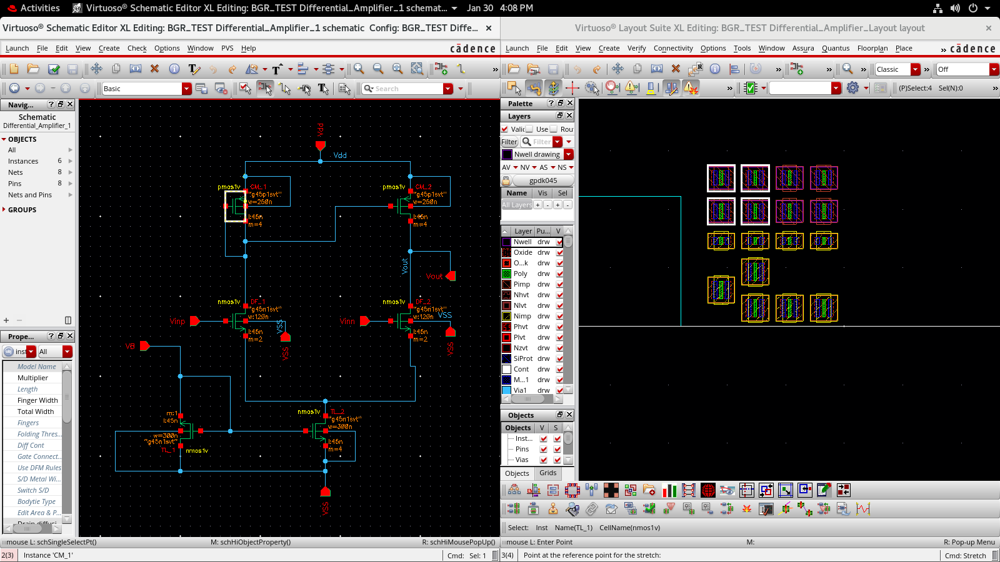
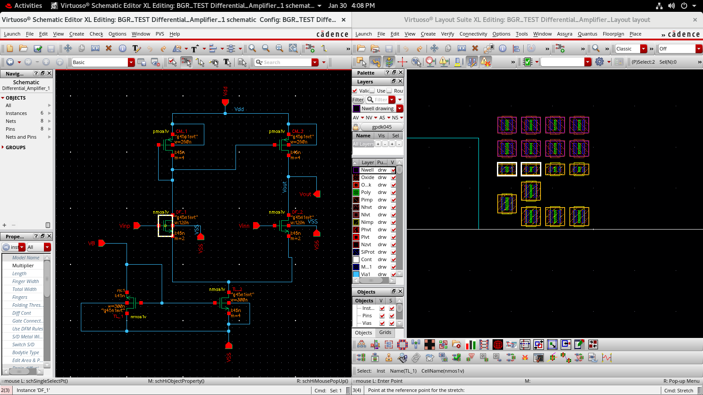
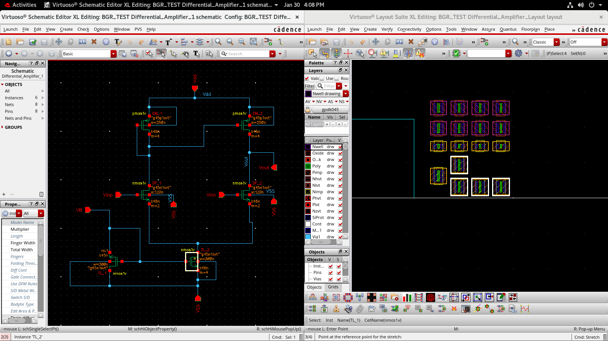
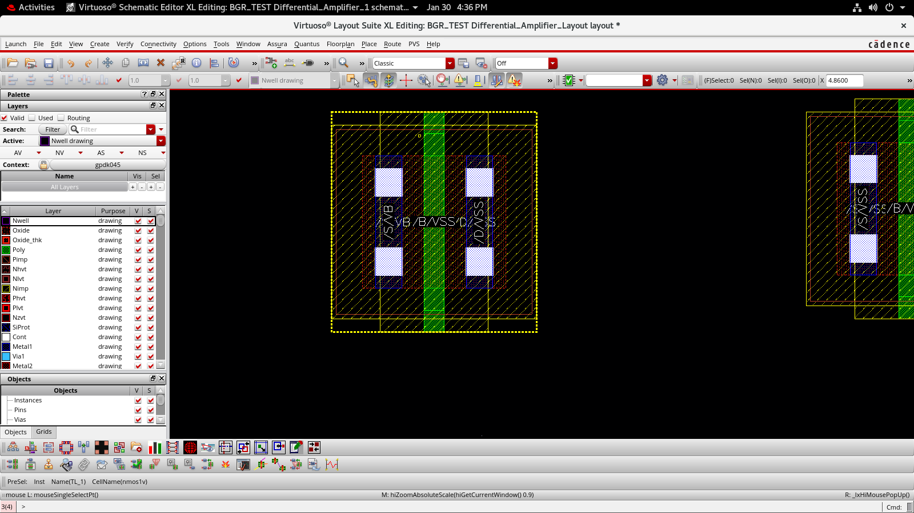
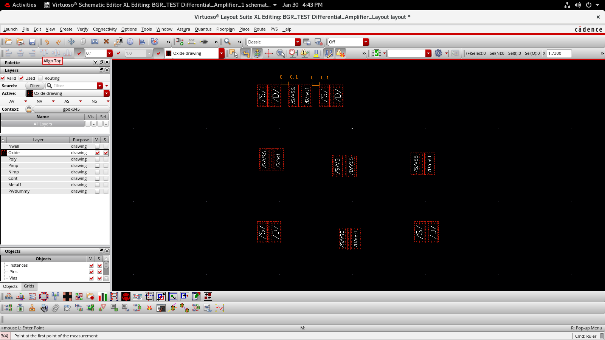
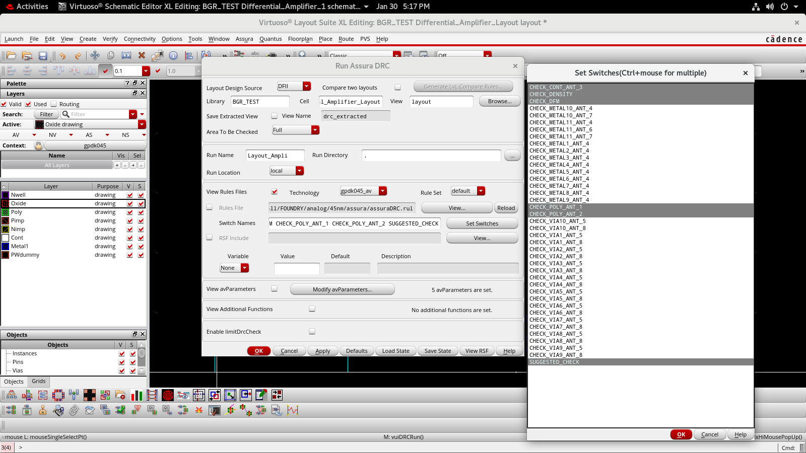
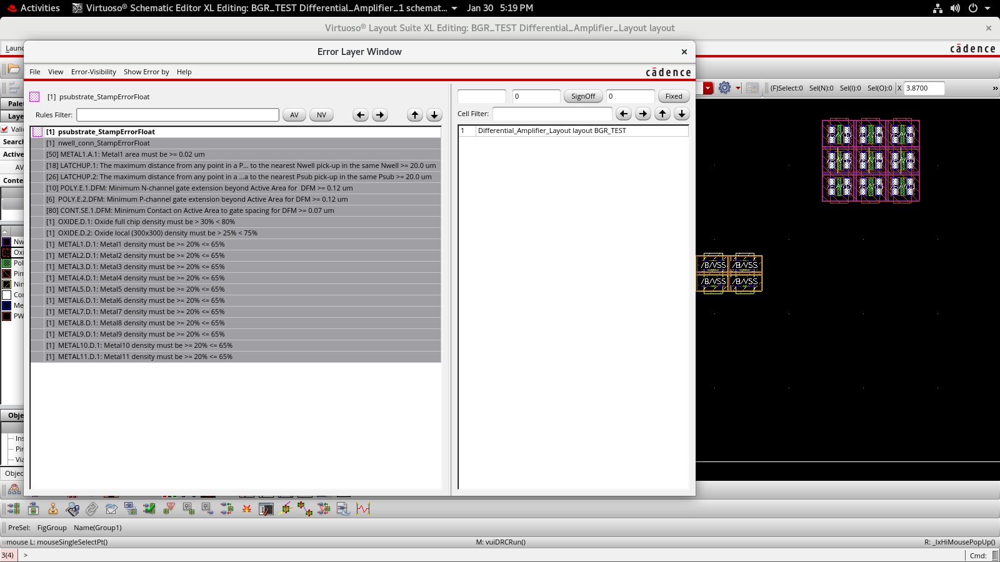

# Day 4 – Layout Design of Differential Amplifier (BGR Core)

## Objective

The objective of Day 4 is to implement the **physical layout** of the Differential Amplifier used in the Bandgap Reference (BGR) circuit and verify that it satisfies foundry design rules using **Design Rule Check (DRC)**.

This step ensures that the schematic design can be fabricated without violations.

---

## 1. Circuit and Opening of Layout

**Image Name:** `images01_schematic_and_layout_launch.png`

The layout process starts from the Differential Amplifier schematic.  
Using **Layout Suite XL**, the layout view is generated directly from the schematic, ensuring correct schematic–layout connectivity.

---

## 2. Enabling Visibility Only for Oxide Layer

**Image Name:** `images02_oxide_layer_visibility.png`

Only the **Oxide layer** visibility is enabled while all other layers are turned off.

### Purpose:
- Identify active regions of MOSFETs
- Understand physical placement
- Reduce visual complexity during layout analysis

---

## 3. Identifying MOSFETs Connected to CS_1

**Image Name:** `images03_cs1_connected_mosfets.png`

This step helps identify all MOSFETs electrically connected to the **CS_1 current source transistor**, ensuring correct matching and symmetry in layout.

---

## 4. DF_1 Connected MOSFETs

**Image Name:** `images04_df1_connected_mosfets.png`

MOSFETs connected to **DF_1** are identified to maintain accurate current mirroring and signal integrity.

---

## 5. TL_2 Connected MOSFETs

**Image Name:** `images05_tl2_connected_mosfets.png`

This step confirms proper connectivity of the **tail current source (TL_2)** devices in the differential amplifier.

---

## 6. Zoomed View of MOSFET Layers

**Image Name:** `images06_mosfet_layer_zoom.png`

A zoomed-in view of MOSFET layers shows:
- Diffusion
- Poly
- Contacts
- Metal connections

This ensures compliance with layout topology and matching constraints.

---

## 7. Setting Adjacent MOSFET Spacing

**Image Name:** `images07_adjacent_mosfet_spacing.png`

Adjacent MOSFET spacing is set to **0.1 µm** to satisfy matching and DRC requirements.

---

## 8. Selecting DRC Technology

**Image Name:** `images08_drc_technology_selection.png`

The DRC is configured for the **gpdk045 technology**, ensuring foundry-specific design rules are applied.

---

## 9. DRC Error Path Identification

**Image Name:** `images09_drc_error_path.png`

The error window highlights specific layout rule violations and the exact physical locations where corrections are required.

---

## 10. DRC Results

**Image Name:** `images10_drc_results.png`

Final DRC results confirm:
- All critical violations identified
- Layout reviewed against technology rules
- Design ready for further LVS verification

---

## Conclusion

The Differential Amplifier layout for the BGR core was successfully created using Layout Suite XL.  
Critical device matching, spacing constraints, and connectivity were verified.  
DRC analysis using gpdk045 confirms that the layout is **fabrication-ready**.

This completes the **Day 4 – Physical Layout and DRC Verification** stage of the Analog IC Design flow.
