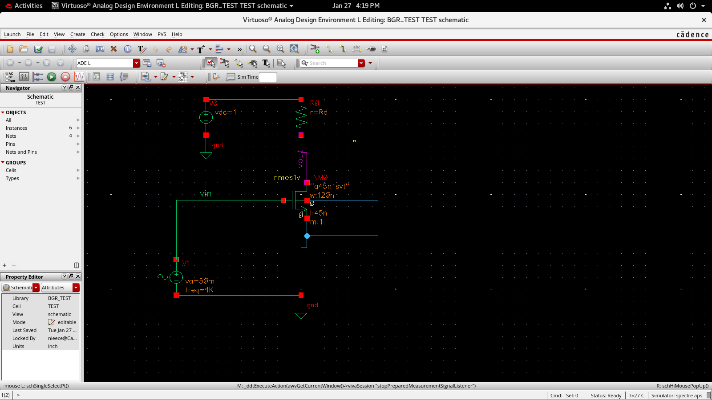

# Day 01 – MOS Fundamentals and Cadence Workflow

Day 01 started with theoretical foundations of **mixed-signal IC design**
and gradually transitioned into understanding the **Cadence Virtuoso design
environment**, library structure, and basic circuit simulation flow using
a simple NMOS circuit.

The emphasis was on *why analog reference circuits are required* and
*how Cadence supports the complete analog IC design flow*.

---

## 1. Introduction to Mixed-Signal IC Design

A **mixed-signal IC** contains both **analog** and **digital** circuits
on the same chip.

### Analog Circuits
- Continuous-time signals
- Sensitive to noise, temperature, and process variations
- Examples: amplifiers, reference circuits, PLL blocks

### Digital Circuits
- Discrete logic levels (0 and 1)
- Strongly dependent on clock quality
- More robust to noise compared to analog circuits

---

## 2. Clock Non-Idealities in Digital Systems

Digital IC performance heavily depends on clock stability.

### Common Timing Issues
- **Jitter**: short-term variation in clock edge timing
- **Skew**: difference in arrival time of clock edges
- **Timing violations**: setup and hold time failures

To generate a clean and stable clock, a **PLL (Phase Locked Loop)** is used.

### Major PLL Blocks
- Phase Detector
- Charge Pump
- Loop Filter (LPF)
- Voltage Controlled Oscillator (VCO)
- Feedback Divider

PLL performance depends on a **stable reference voltage**, which again
comes from analog reference circuits.

---

## 3. Why Reference Circuits Are Required

In real ICs, circuit behavior should **not change** with external conditions.

### Major Variations Affecting ICs
1. **Supply Voltage Variation**
2. **Temperature Variation**
3. **Process Variation**

These three are collectively called **PVT variations**
(Process, Voltage, Temperature).

---

## 4. Process Variation Examples

Process variations are **not under designer control**.

Typical variations include:
- BJT current gain (β): ±30%
- MOS mobility (μ): ±10%
- MOS threshold voltage (Vth): ±100 mV
- Resistors: ±20%
- Capacitors: ±5%
- Inductors: ±1%

Because of these variations, reference voltages and currents must be
**generated internally** and be **temperature independent**.

---

## 5. Need for Bandgap Reference (BGR)

A **Bandgap Reference circuit** generates a stable reference voltage
that is:
- Independent of supply voltage
- Independent of temperature
- Robust against process variation

### Typical Bandgap Concept
- CTAT voltage: Base–Emitter voltage (VBE)
- PTAT voltage: Difference in VBE (ΔVBE)

By properly scaling and adding these,
a temperature-independent reference voltage is generated.

---

## 6. Monte Carlo and Corner Analysis

To verify robustness, circuits are tested using:

### Corner Analysis
- Checks worst-case PVT conditions

### Monte Carlo Simulation
- Random variation of device parameters
- Verifies statistical reliability of the design

---

## 7. Overview of Cadence Mixed-Signal Design Flow

### Analog / RF Design Flow
- Schematic capture
- Analog simulation (DC, AC, Transient)

### Digital Design Flow
- Design entry
- Behavioral simulation
- Synthesis
- Place and route
- Functional verification

### Mixed-Signal Verification
- Done after design is locked

### Physical Design
- Analog layout
- Physical verification
- Post-layout simulation

### Final Step
- Full-chip integration
- Mixed-signal verification
- Tape-out (GDSII generation)

---

## 8. Cadence Virtuoso Environment Basics

Cadence follows a **hierarchical structure**:

- **Library**
- **Cell**
- **View**

### Common Views
- schematic
- symbol
- testbench
- layout

Technology libraries and analog libraries must be attached
before starting schematic design.

---

## 9. First Circuit Implemented – NMOS Common Source

A basic **NMOS common-source amplifier** was designed to understand:
- Device operation
- Biasing
- Simulation workflow

### Circuit Description
- NMOS with resistive load at drain
- Gate driven by AC + DC input
- Source connected to ground

**Observation:**
---

## 10. Simulation Setup in Cadence

### DC Analysis
- Used to find the operating point
- Ensures NMOS is in saturation region

### Transient Analysis
- Input amplitude: 50 mV
- Frequency: 1 kHz
- Supply voltage: 1 V
- Output shows amplification with phase inversion

### AC Analysis
- Gain observed at low frequency
- Gain roll-off at high frequency
- Phase shift due to parasitic capacitances

---

## 11. Key Learnings from Day 01

- Analog IC design is highly sensitive to PVT variations
- Reference circuits are essential for reliable operation
- Cadence enforces a disciplined design methodology
- Simulation results must be **interpreted**, not just observed
- Proper documentation is part of good analog design practice

---

## 12. Conclusion

Day 01 established the **theoretical foundation** and **tool familiarity**
required for analog IC design. Understanding the motivation behind
reference circuits and learning the Cadence workflow sets the base for
designing more complex blocks such as current mirrors, amplifiers, and
bandgap reference circuits in subsequent sessions.
