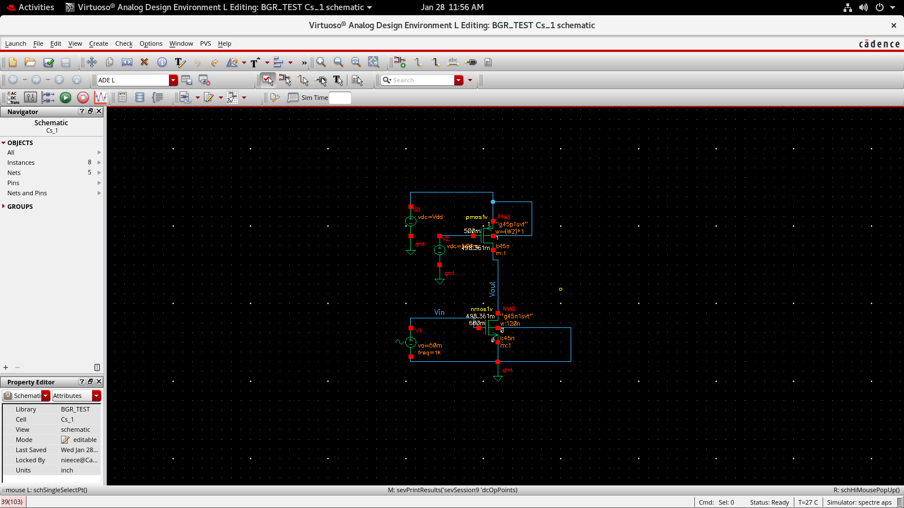
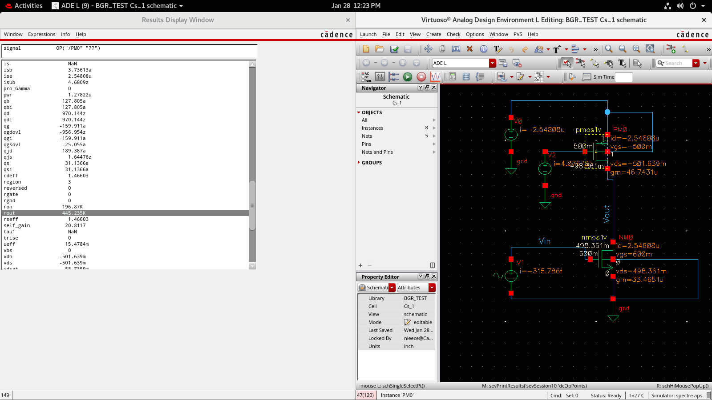
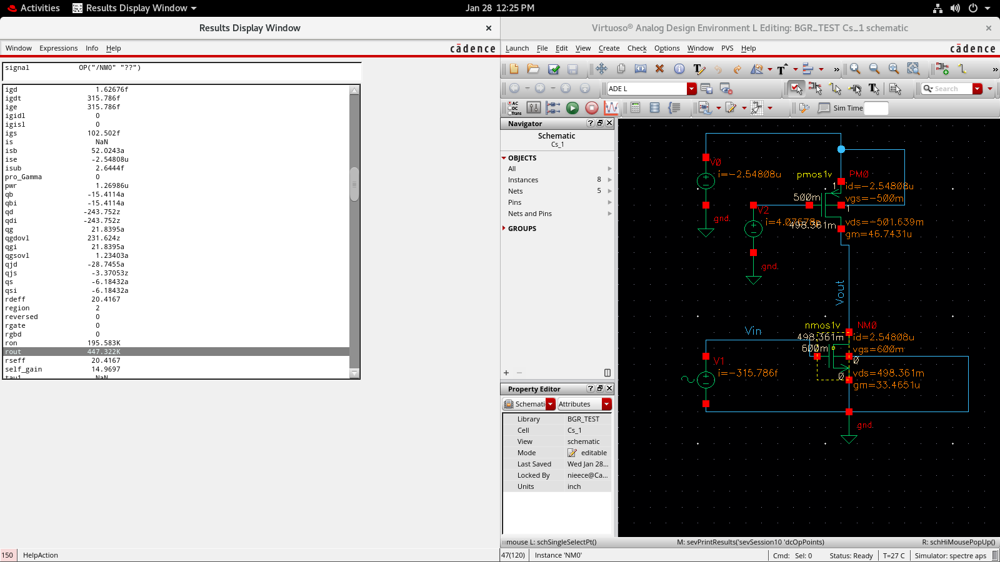
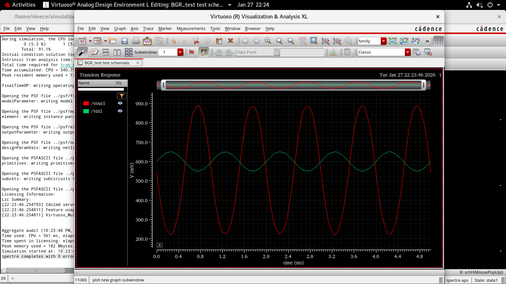
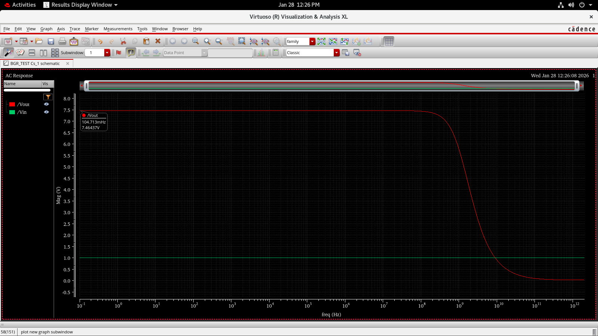

# Common Source Amplifier with PMOS Bias – Gain Verification

> Tool: Cadence Virtuoso (Spectre APS)  
> Analyses: DC Operating Point, Small-Signal Parameter Extraction, Transient, AC

---

##  Objective

The objective of this experiment is to **design and verify the voltage gain of a Common Source (CS) amplifier** using:

- An **NMOS transistor as the amplifying device**
- A **PMOS transistor biased using an external bias voltage (Vbias)** as an active load

The gain is verified by:
- Extracting small-signal parameters (`gm`, `ro`) from DC analysis
- Calculating theoretical gain using small-signal equations
- Comparing the theoretical value with AC analysis results

---

##  Circuit Description

### Topology Overview
- **NMOS (NM0)** configured in common source configuration
- **PMOS (PM0)** used as an active load
- **Gate of PMOS is driven by an external bias voltage (Vbias)**
- Input signal (**Vin**) applied to NMOS gate
- Output (**Vout**) taken at the drain of NMOS

Unlike a diode-connected PMOS load, the **biased PMOS provides a more ideal current source behavior**, resulting in:
- Higher output resistance
- Improved gain control
- Better bias stability

---

### Schematic

*Figure 1: Common Source amplifier with externally biased PMOS active load.*

---

##  Why Vbias is Applied to PMOS

Applying a **Vbias** to the PMOS gate serves the following purposes:

- Forces the PMOS to operate as a **constant current source**
- Prevents signal-dependent variations at the PMOS gate
- Improves **output resistance (ro)**
- Enables accurate **small-signal gain analysis**
- Mimics realistic biasing used in analog IC blocks

This biasing approach is widely used in:
- Operational amplifier gain stages
- Bandgap reference amplifiers
- Bias distribution networks

---

##  DC Operating Point Analysis

### Purpose
DC analysis is performed to:
- Ensure NMOS and PMOS operate in **saturation**
- Verify correct biasing using **Vbias**
- Extract small-signal parameters (`gm`, `ro`)
- Establish a valid operating point for gain calculation

---

### PMOS Small-Signal Parameter Extraction

From the DC operating point:
- PMOS output resistance  
  **ro(pmos) ≈ 445.235 kΩ**

The high value confirms that the **PMOS behaves as a good current source due to Vbias**.

---

### NMOS Small-Signal Parameter Extraction

From DC operating point:
- NMOS transconductance  
  **gm(nmos) ≈ 33.465 µS**
- NMOS output resistance  
  **ro(nmos) ≈ 447.322 kΩ**

Both devices are confirmed to be operating in the **saturation region**.

---

##  Theoretical Gain Calculation

For a Common Source amplifier with a biased PMOS active load:

\[
A_v = -g_m \cdot (r_{o,n} \parallel r_{o,p})
\]

### Substituting extracted values:

\[
r_o = r_{o,n} \parallel r_{o,p}
\]

\[
A_v = -33.465 \times 10^{-6} \times (447.322k \parallel 445.235k)
\]

\[
A_v \approx -7.4673 \; \text{V/V}
\]

 This represents the **theoretically calculated gain**.

---

##  Transient Analysis

### Purpose
Transient analysis verifies:
- Time-domain amplification
- Phase relationship between input and output
- Correct biasing using Vbias (no distortion or clipping)

---

### Transient Response

*Figure 4: Transient response showing amplified output with 180° phase inversion.*

Observation:
- Output signal is amplified
- **180° phase inversion**, confirming CS behavior
- No waveform distortion, validating proper biasing

---

##  AC Analysis (Gain Verification)

### Purpose
AC analysis is used to:
- Measure small-signal voltage gain
- Validate theoretical gain derived from DC parameters

---

### AC Response

*Figure 5: AC magnitude response showing midband gain.*

Observation:
- Midband gain from AC analysis:  
  **|Av| ≈ 7.46437 V/V**

---

##  Gain Verification Summary

| Method | Gain (V/V) |
|------|------------|
| Theoretical (gm·ro) | 7.4673 |
| AC Analysis | 7.46437 |

✔️ Excellent agreement confirms:
- Correct Vbias application
- Accurate parameter extraction
- Valid small-signal model

---

##  Verification Checklist

### DC Verification
- NMOS and PMOS in saturation
- PMOS correctly biased using Vbias
- Valid `gm` and `ro` extracted

### Transient Verification
- Clean amplification
- 180° phase inversion
- No clipping or distortion

### AC Verification
- Gain matches theoretical value
- Flat midband response

---

##  Key Learnings

- External Vbias improves PMOS current source behavior
- Gain depends on both `gm` and output resistance
- DC biasing directly impacts AC performance
- Small-signal models must be validated through simulation

---

##  Conclusion

A Common Source amplifier with an **externally biased PMOS active load** was successfully designed and verified. Applying Vbias to the PMOS gate ensured stable current-source operation and high output resistance. The voltage gain calculated using small-signal parameters closely matched the AC analysis result, validating the correctness of the design and analysis methodology used in Cadence Virtuoso.

---
