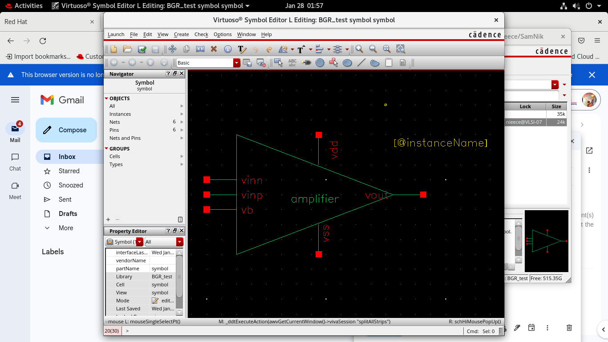
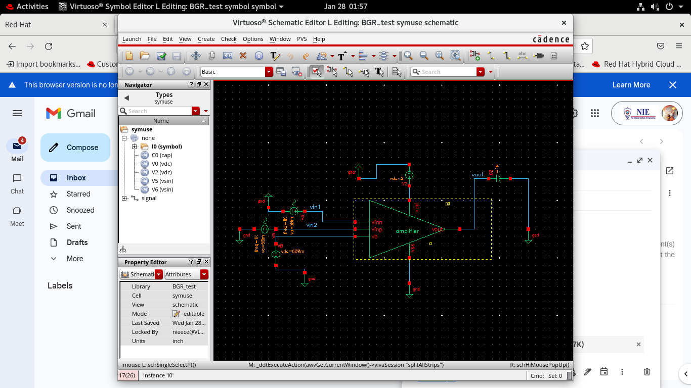
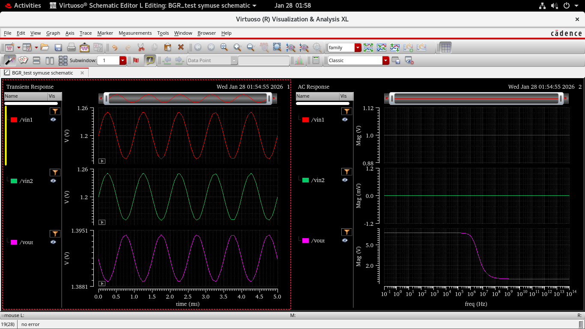

# Differential Amplifier Using Custom Symbol (Hierarchical Design)

> Tool: Cadence Virtuoso (Spectre APS)  
> Circuit Type: Differential Amplifier  
> Analyses: Transient, AC  
> Design Methodology: Symbol creation and hierarchical verification

---

##  Objective

The objective of this experiment is to:

- Create a **custom symbol** for the previously designed  
  **Differential Amplifier with PMOS Current-Mirror Load and NMOS Tail Current Source**
- Use the symbol in a **top-level schematic**
- Verify that the **electrical behavior remains unchanged**
- Confirm identical **Transient and AC responses**

This step demonstrates **hierarchical design**, a critical practice in analog IC development.

---

##  Circuit Continuity (Important Note)

 **This is NOT a new circuit.**

- The internal transistor-level schematic remains **unchanged**
- Only a **symbol abstraction** is created and used
- Functional behavior must match the original differential amplifier

This validates **design reusability and modularity**.

---

##  Step 1: Original Differential Amplifier (Reference)

The base circuit consists of:
- NMOS differential input pair
- PMOS current mirror active load
- NMOS tail current source
- Single-ended output

This circuit was already verified for correct operation in earlier steps.

---

##  Step 2: Preparing the Circuit for Symbol Creation

Before creating the symbol:

- All **input sources** and **ground connections** are removed
- Only **essential terminals** are retained
- Circuit is converted into a reusable block

### Required Pins Identified
- `Vinp` – Non-inverting input
- `Vinn` – Inverting input
- `VB` – Bias voltage
- `VDD` – Supply voltage
- `VSS` – Ground
- `Vout` – Output

---

##  Step 3: Creating the Symbol

### Procedure
1. Open the circuit schematic
2. Navigate to:  
   **Create → Cellview → From Cellview**
3. Choose **Symbol** view
4. Define pins with:
   - Direction: input / output
   - Usage: schematic
   - Signal type: signal

---

### Pin Placement Convention

| Pin | Position |
|----|--------|
| VDD, VB | Top |
| Vinp, Vinn | Left |
| VSS | Bottom |
| Vout | Right |

This follows **industry-standard schematic readability**.

---

### Created Symbol

*Figure 1: Custom symbol created for the differential amplifier.*

---

##  Step 4: Using the Symbol in Top-Level Schematic

The created symbol is instantiated in a new schematic and connected to:
- Input signal sources
- Bias voltage (VB)
- Supply (VDD)
- Ground (VSS)
- Output load

---

### Symbol-Based Schematic

*Figure 2: Differential amplifier implemented using the custom symbol.*

---

##  Step 5: Transient Analysis (Verification)

### Purpose
To verify:
- Differential signal amplification
- No functional change after symbol abstraction

---

### Transient Response

*Figure 3: Transient response using symbol-based design.*

### Observation
- Output waveform matches the original circuit
- Proper amplification of differential input
- No distortion or phase anomaly introduced

---

##  Step 6: AC Analysis (Verification)

### Purpose
To confirm:
- Gain remains unchanged
- Frequency response is preserved

---

### AC Response

*Figure 4: AC response of symbol-based differential amplifier.*

### Observation
- Midband gain matches previous design
- Bandwidth and roll-off characteristics remain identical
- Confirms correct hierarchical abstraction

---

##  Verification Summary

| Parameter | Result |
|---------|-------|
| Circuit Topology | Unchanged |
| Transient Response | Matches original |
| AC Gain | Matches original |
| Frequency Response | Preserved |
| Symbol Integrity | Verified |

---

##  Key Learnings

- Symbol creation enables **hierarchical IC design**
- Large analog systems are built from verified blocks
- Electrical behavior must remain unchanged after abstraction
- Proper pin naming and placement improves readability
- This methodology is used in **op-amps, ADCs, BGRs**

---

##  Conclusion

A custom symbol was successfully created for the differential amplifier and used in a higher-level schematic. Transient and AC analyses confirmed that the symbol-based design exhibits identical behavior to the original transistor-level circuit. This validates the correctness of symbol creation and demonstrates hierarchical design practices essential for large-scale analog IC development.

---
