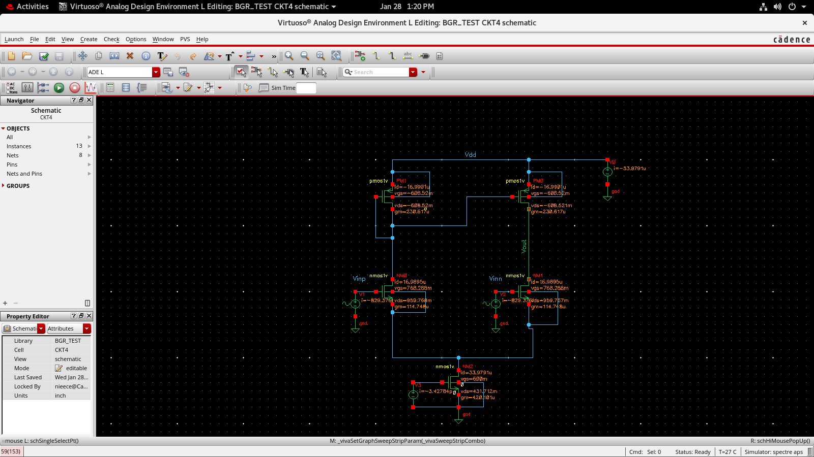
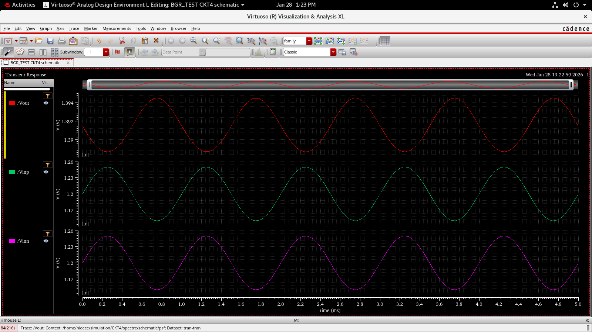
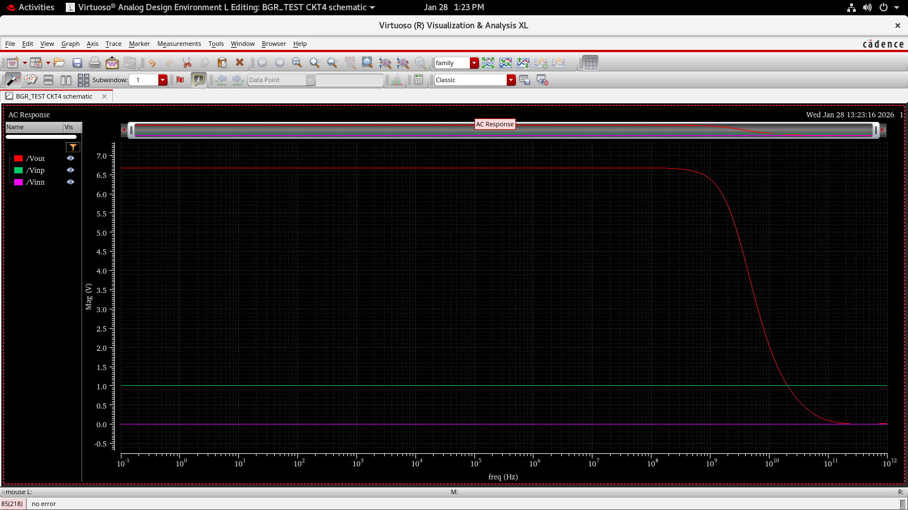
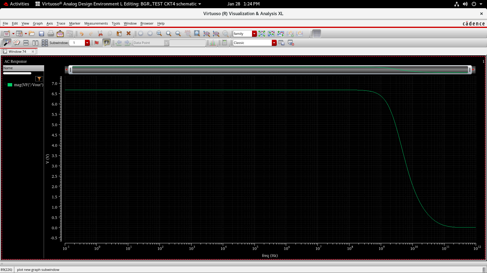

# Differential Amplifier with PMOS Current Mirror Load

> Tool: Cadence Virtuoso (Spectre APS)  
> Analyses: DC Operating Point, Transient Analysis, AC Analysis, Magnitude Response

---

##  Objective

The objective of this experiment is to design and analyze a **Differential Amplifier** using:

- **NMOS differential input pair**
- **PMOS current mirror as active load**
- **NMOS tail current source**

The circuit is evaluated for:
- Differential operation
- Signal amplification
- Frequency response
- Gain verification using AC and magnitude plots

This topology forms the **core input stage of operational amplifiers and bandgap reference circuits**.

---

##  Circuit Description

### Major Architectural Change

Unlike previous circuits (single-ended CS amplifiers), this circuit introduces:

- **Two input signals**:  
  - `Vinp` (non-inverting input)  
  - `Vinn` (inverting input)
- **Differential amplification**
- **Current mirror load** for single-ended output conversion

---

### Topology Overview

- **NMOS (NM0, NM1)** form a **differential input pair**
- **NMOS (NM2)** acts as a **tail current source**
- **PMOS (PM0, PM1)** form a **current mirror active load**
- Output is taken **single-ended** from one drain node (`Vout`)
- Supply voltage applied at `VDD`

---

### Schematic

*Figure 1: Differential amplifier with NMOS input pair, PMOS current mirror load, and NMOS tail current source.*

---

##  Why This Circuit Is Used

This topology is preferred because:

- Amplifies the **difference** between two inputs
- Rejects **common-mode noise**
- Provides **high gain** using active loads
- Converts differential signal to **single-ended output**
- Forms the **first stage of operational amplifiers**

This is a **real analog IC block**, not a lab-only circuit.

---

##  DC Operating Point Analysis

### Purpose
DC analysis ensures:
- All MOSFETs operate in **saturation**
- Tail current is properly set
- Current mirror is correctly biased
- Valid operating point for AC and transient analysis

From schematic annotation:
- Differential pair devices are biased symmetrically
- PMOS current mirror ensures equal load currents
- Tail current source stabilizes total current

---

##  Transient Analysis

### Purpose
Transient analysis verifies:
- Differential signal amplification
- Phase relationship between inputs and output
- Proper current steering behavior

---

### Transient Response

*Figure 2: Transient response showing differential inputs and amplified single-ended output.*

### Observations
- `Vinp` and `Vinn` are applied as differential inputs
- Output voltage varies according to input difference
- Proper amplification without distortion
- Confirms correct differential operation

---

##  AC Analysis (Small-Signal Response)

### Purpose
AC analysis is performed to:
- Measure differential gain
- Observe frequency response
- Identify bandwidth limitations

---

### AC Response

*Figure 3: AC response showing flat midband gain and high-frequency roll-off.*

### Observations
- Flat gain region at low and mid frequencies
- Gain roll-off at high frequencies due to parasitic capacitances
- Confirms stable amplifier operation

---

##  Magnitude Plot (Gain in dB)

### Purpose
Magnitude plot provides:
- Gain representation in logarithmic (dB) scale
- Clear visibility of bandwidth and roll-off

---

### Magnitude Response

*Figure 4: Magnitude plot showing midband gain of approximately 10 dB.*

### Observation
- Midband gain ≈ **10 dB**
- Consistent with linear AC response
- Confirms amplifier gain stability over frequency

---

##  Verification Summary

| Analysis Type | Verification |
|--------------|-------------|
| DC Analysis | All devices in saturation |
| Transient | Differential amplification confirmed |
| AC Analysis | Stable midband gain |
| Magnitude Plot | ~10 dB gain verified |

---

##  Key Learnings

- Differential amplifiers suppress common-mode noise
- Current mirror loads enable high gain and single-ended output
- Tail current source stabilizes operating point
- AC and magnitude plots validate frequency behavior
- This topology is the **foundation of op-amps**

---

##  Conclusion

A differential amplifier with PMOS current mirror load and NMOS tail current source was successfully designed and analyzed. Transient analysis confirmed correct differential operation, while AC and magnitude analyses verified stable gain and frequency response. This circuit represents a fundamental analog IC building block used in operational amplifiers and precision analog systems.

---
