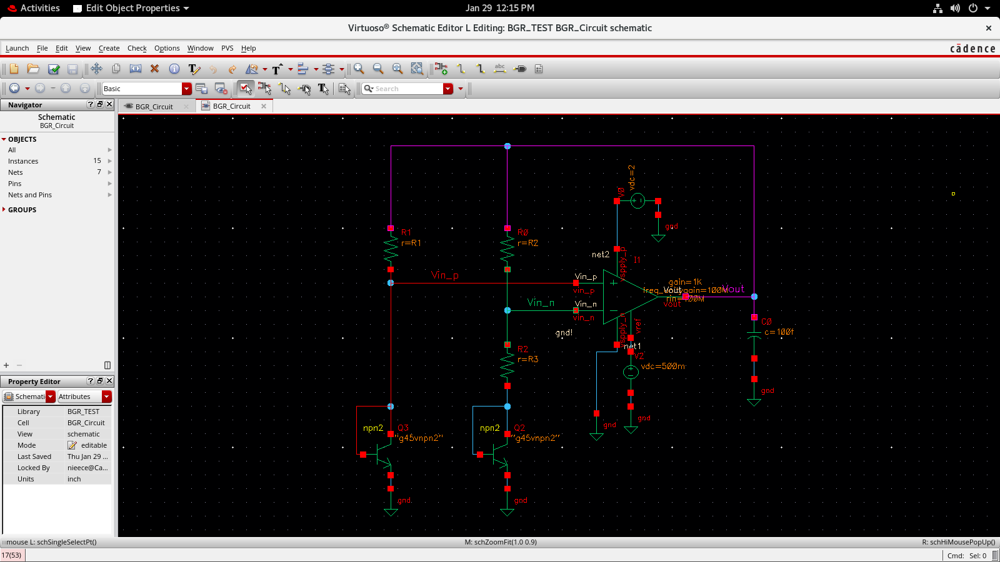
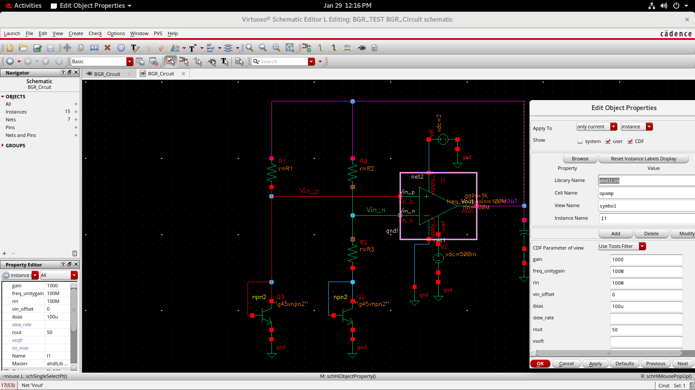
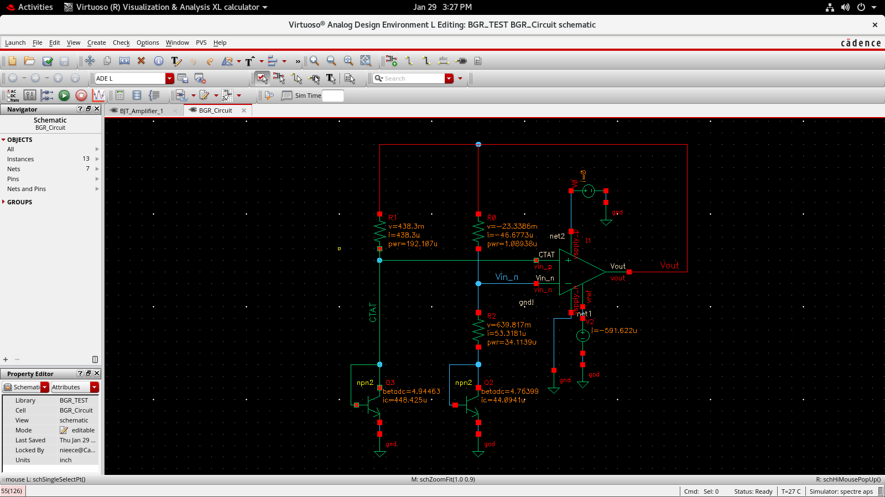
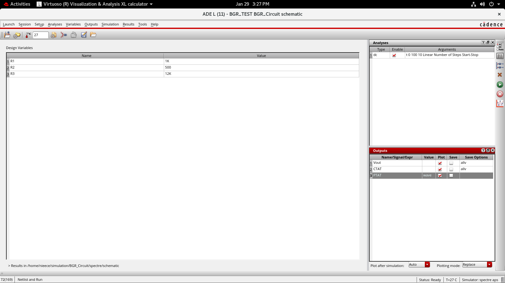
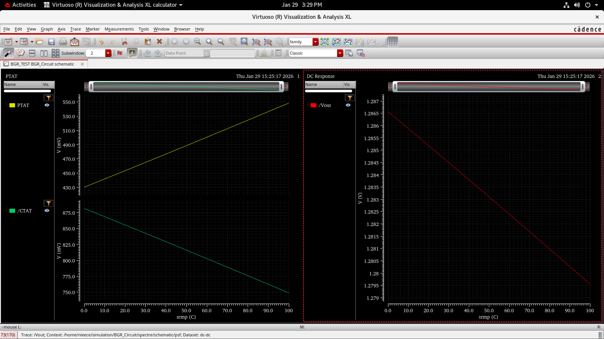

# Bandgap Reference (BGR) Circuit Design and Analysis

> Tool: Cadence Virtuoso (Spectre APS)  
> Technology: gpdk045  
> Analyses: DC Operating Point, Temperature Sweep, PTAT/CTAT Extraction  
> Objective: Generate a temperature-stable reference voltage

---

##  Objective

The objective of this experiment is to design and analyze a **Bandgap Reference (BGR)** circuit that produces a nearly temperature-independent output voltage by combining:

- **CTAT voltage** (Complementary To Absolute Temperature)
- **PTAT voltage** (Proportional To Absolute Temperature)

The performance of the circuit is verified using DC operating point analysis and temperature sweep simulations.

---

##  Circuit Overview

A bandgap reference exploits the opposite temperature behavior of two voltages:

- **CTAT**: Base–Emitter voltage (Vbe) of a BJT  
- **PTAT**: Difference of base–emitter voltages (ΔVbe) between two BJTs operating at different current densities  

By summing these two components with proper weighting, the temperature dependence can be minimized.

---

##  Circuit Schematic

**Main blocks:**
- Two BJTs operating at different current densities
- Three resistors (R1, R2, R3) to scale PTAT and CTAT terms
- An op-amp to enforce node equality and generate ΔVbe
- Output node producing the reference voltage (Vout)

---

##  Op-Amp Configuration

The op-amp is taken from the inbuilt library and configured with:

- High DC gain  
- High input resistance  
- Finite output resistance  
- Limited bandwidth and bias current  

 **Note:**  
The op-amp is not the design focus here. It is used as a functional block to force node equality, ensure accurate ΔVbe generation, and maintain closed-loop stability.

---

##  DC Operating Point Analysis

DC operating point analysis confirms:

- All BJTs are in the **forward-active region**
- Stable bias currents flow through R1, R2, and R3
- No floating or undefined nodes
- Op-amp output is within a valid swing range

This step is mandatory before performing temperature sweeps.

---

##  Resistor Selection and Design Methodology

The resistor values were determined using:
- Analytical understanding of PTAT–CTAT cancellation
- Trial-and-error tuning using simulation feedback

Final resistor values:

| Resistor | Value |
|--------|-------|
| R1 | 1 kΩ |
| R2 | 500 Ω |
| R3 | 12 kΩ |

 **Design Insight:**  
Resistor ratios determine the scaling factor of the PTAT voltage relative to the CTAT voltage, directly impacting temperature compensation.

---

##  PTAT, CTAT and Vout vs Temperature

- **CTAT voltage (Vbe)** decreases with temperature  
- **PTAT voltage (ΔVbe = Vin_n − Vin_p)** increases with temperature  
- **Vout**, formed by the weighted sum of PTAT and CTAT, remains nearly constant  

This confirms correct first-order bandgap operation.

---

##  Temperature Coefficient (Slope) Extraction

Using the calculator, the slope of output voltage with temperature was computed:

\[
\frac{dV_{out}}{dT} \approx -68~\mu V/^\circ C
\]

### Interpretation
- Temperature coefficient is low
- Output variation is minimal across 0–100 °C
- Performance is acceptable for a basic first-order bandgap reference

 **Important Clarification:**  
Temperature slope is measured in **µV/°C or ppm/°C**, not in dB.

---

##  Verification Summary

| Parameter | Observation |
|---------|------------|
| Biasing | Stable |
| BJT Region | Forward-active |
| PTAT | Positive slope |
| CTAT | Negative slope |
| Vout Stability | High |
| Temp Coefficient | ≈ −68 µV/°C |

---

##  Key Learnings

- Bandgap references combine PTAT and CTAT voltages
- Op-amp enforces ΔVbe generation
- Resistor ratios control temperature cancellation
- DC operating point verification is essential
- Temperature sweep validates reference stability

---

##  Conclusion

A functional bandgap reference circuit was successfully designed and verified using Cadence Virtuoso. By properly scaling PTAT and CTAT components using resistor ratios, a nearly temperature-independent output voltage was achieved. The measured temperature coefficient of approximately −68 µV/°C confirms effective first-order temperature compensation.

This experiment demonstrates fundamental BGR design principles used in analog IC design.

---
