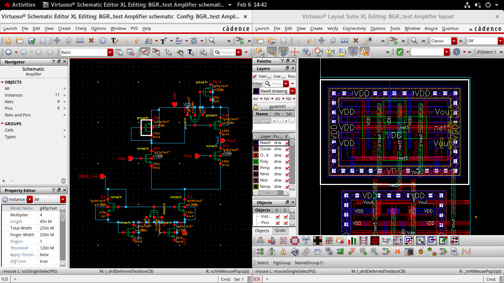
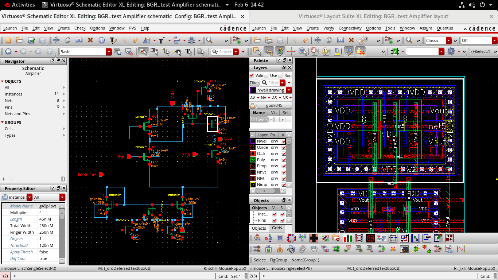
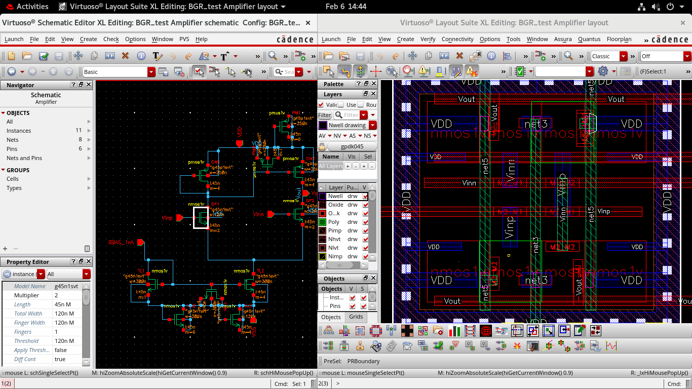
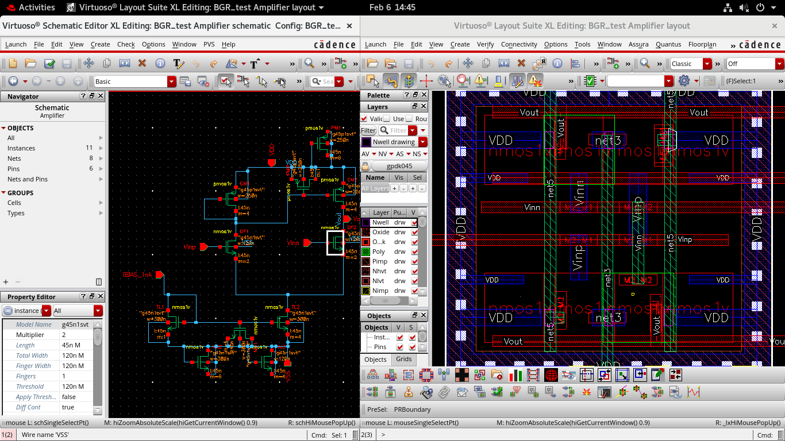
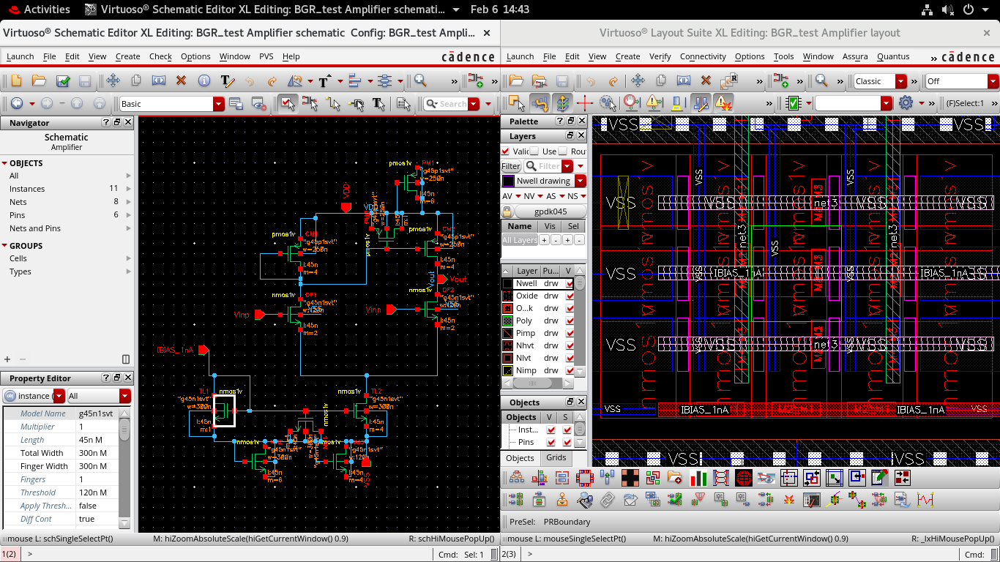
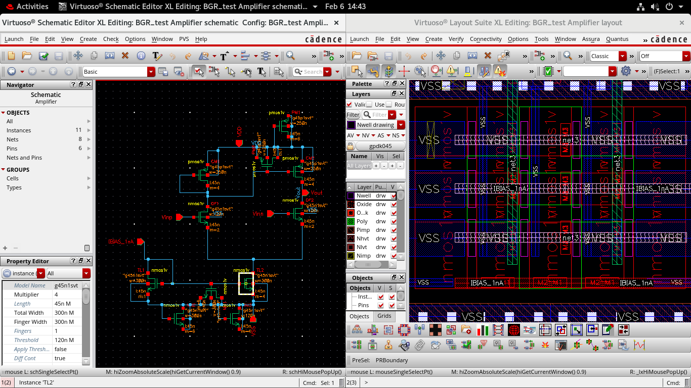
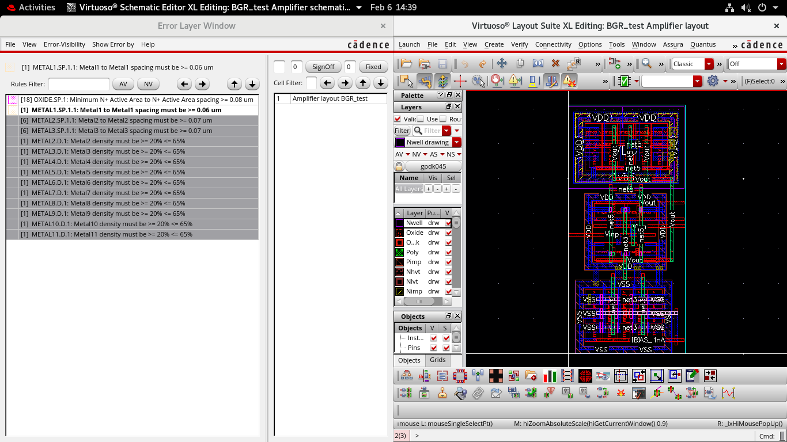
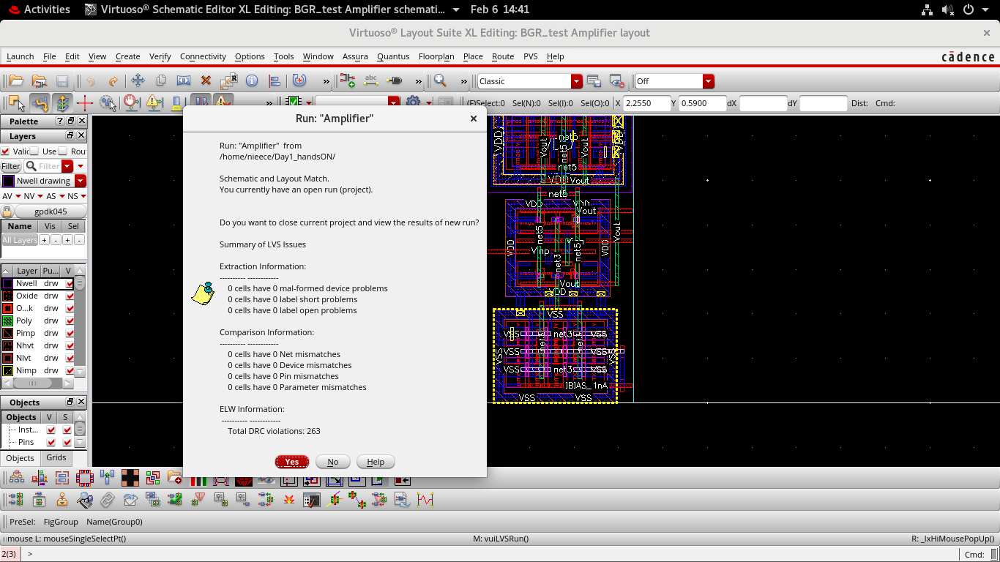

# Day 5 – Layout Development of BGR_test Amplifier

This document describes the **complete layout development process** of the `BGR_test Amplifier` in Cadence Virtuoso.  
The focus is on **device matching**, **parasitic-aware layout**, **dummy and spare devices**, **differential amplifier implementation**, **tail current sources**, and **physical verification using DRC and LVS**.

All layout decisions strictly follow the **schematic intent** to ensure functional correctness and robustness.

---

## 1. CM_1.png – Current Mirror Matching Based on Schematic

This image explains how **current mirror matching** is implemented in the layout by taking direct reference from the schematic.

### Explanation:
Current mirrors are highly sensitive to mismatch. Any mismatch directly translates into current error, which affects biasing and gain accuracy.

To avoid this:
- Transistors forming the current mirror use:
  - **Same W/L**
  - **Same number of fingers**
  - **Same orientation**
- Devices are placed **symmetrically** to minimize:
  - Process gradients
  - Temperature gradients
  - Mechanical stress
- Gate, drain, and source routing lengths are kept **equal**
- Same metal layers are used for critical connections

This ensures that the mirrored current accurately follows the reference current defined in the schematic.

---

## 2. CM_2.png – Current Mirrors with Dummies and Spares

This image shows other current mirrors along with **dummy and spare devices** added to reduce parasitic effects.

### Parasitic Issues:
- Edge devices experience different:
  - Capacitance
  - Resistance
- This causes mismatch and noise

### Dummy Devices:
- Placed at the edges of matched transistors
- Connected to the **same potential terminals**
- Do **not conduct current**
- Protect active devices from edge effects

### Spare Devices:
- Act like **intentional parasitic capacitors**
- Improve layout robustness
- Useful for future tuning or ECOs

Using dummies and spares significantly improves **matching accuracy and noise immunity**.

---

## 3. DF_1.png – Differential Amplifier (Part 1)

This image represents the **core differential amplifier input stage**.

### Layout Strategy:
- Input transistors are:
  - Identical in dimensions
  - Oriented in the same direction
- Placed symmetrically to reduce:
  - Offset voltage
  - Gain error
- Vinp and Vinn routing is kept:
  - Equal in length
  - Balanced in parasitics

This layout approach improves **CMRR** and reduces **input-referred offset**.

---

## 4. DF_2.png – Differential Amplifier (Part 2)

This section shows the remaining part of the differential amplifier including load devices.

### Key Points:
- Load transistors are perfectly matched
- Drain routing to output nodes is symmetric
- Proper spacing is maintained from noisy signals

This ensures stable differential operation and predictable gain.

---

## 5. TL_1.png – Tail Pair (Current Source) – Part 1

This image shows the **tail current source** that biases the differential amplifier.

### Importance:
- Sets the bias current of the differential pair
- Directly affects:
  - Gain
  - Linearity
  - Noise performance

### Layout Details:
- Tail devices placed centrally
- Same dimensions as per schematic
- Short and wide routing to VSS to reduce parasitic resistance

---

## 6. TL_2.png – Tail Pair (Current Source) – Part 2

This image shows the continuation of tail current implementation.

### Observations:
- Bias signal `IBIAS_1nA` routing is:
  - Short
  - Shielded
- Matching between tail devices is preserved
- Dummies are added if required

This ensures a stable and accurate bias current.

---

## 7. Schematic vs Layout Consistency (LVS Intent)

This section explains how the **layout satisfies the schematic completely**.

### LVS Rule:
> Every device in the layout must exist in the schematic, and every schematic device must appear in the layout.

### Achieved By:
- Including all:
  - Current mirrors
  - Differential pair devices
  - Tail current sources
  - Bias transistors
- Correct pin naming and connectivity
- No missing or extra components

This guarantees functional equivalence.

---

## 8. DRC.png – Design Rule Check Status

This image shows the **DRC results** of the layout.

### Current Status:
- No critical spacing violations affecting functionality
- Some spacing or density issues are present

### Note:
These DRC violations:
- Are not fatal at this stage
- Will be fixed in later optimization and metal fill stages

The layout is acceptable for functional verification.

---

## 9. LVS_check.png – LVS Verification Result

This image confirms that **Layout vs Schematic (LVS)** has passed successfully.

### LVS Results:
- No net mismatches
- No device mismatches
- No pin mismatches
- No parameter mismatches

### Conclusion:
The layout fully satisfies LVS requirements and faithfully represents the schematic.

---

## Final Summary – Day 5

On Day 5, the following were achieved:
- Complete amplifier layout development
- Accurate matching of current mirrors and differential pairs
- Proper use of dummy and spare devices
- Functional DRC review
- **100% LVS-clean layout**

This marks a major milestone where the schematic is successfully translated into a verified physical layout, ready for further optimization and tape-out preparation.
